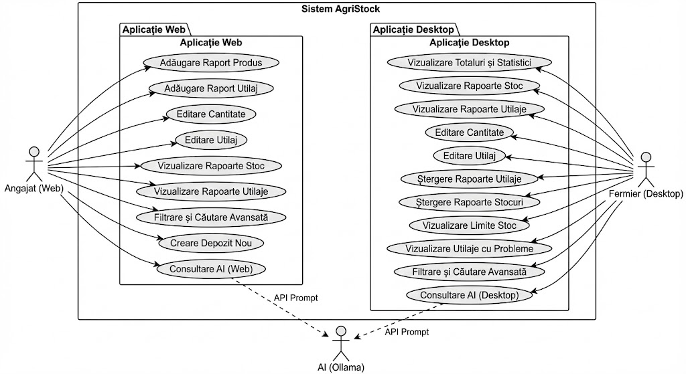

# AgriStock – Agricultural Stock Management Platform

AgriStock is a modular agricultural stock management system designed to help farms manage inventory, machinery, and warehouse operations.
The platform consists of a Vue.js web application for employees, a WPF desktop dashboard for farmers, and a Java Spring Boot backend that handles business logic, data access, and AI-assisted features.

---

## Overview

AgriStock provides a centralized solution for managing agricultural stock, machinery, and warehouse resources.
Employees interact with the system through the web application to register products, update inventory, and manage machinery, while farmers use the desktop dashboard to monitor statistics, detect issues, and analyze operational data.

The platform also integrates an AI chat assistant that helps users with farming-related questions, stock planning, and decision support.

---

## Main Features

* Agricultural stock management
* Machinery management
* Warehouse management
* Desktop dashboard with statistics and reports
* Advanced filtering and search
* Stock limits monitoring
* Problematic machinery tracking
* Multi-role system (Employee / Farmer)
* AI chat assistant integration
* Modular multi-application architecture
* REST-based communication between components

---

## System Architecture



The system is composed of:

* Web application (employee interface)
* Desktop application (farmer dashboard)
* Backend REST API
* AI assistant integration

Both applications communicate with the backend, which manages business logic, persistence, and AI requests.

---

## Project Structure

```
AgriStock_App
│
├── Agri_Stock_Web        - Vue.js web application
├── Agri_Stock_Dashboard  - WPF desktop dashboard (.NET)
└── FarmingApp            - Spring Boot backend + AI integration
```
---

## Technologies Used

### Backend

* Java 17
* Spring Boot
* Spring Web
* Spring WebFlux
* Spring Data JPA
* Maven
* Lombok

### Desktop Application

* C#
* .NET 8
* WPF
* XAML

### Web Application

* Vue.js
* HTML
* CSS
* JavaScript

### Database

* MySQL

### Architecture

* Layered architecture
* REST API communication
* Repository pattern
* Service layer
* Modular multi-project solution

### AI Integration

* Integrated AI chat assistant
* Farming decision support
---

## Key Highlights

* Full-stack multi-application system
* Vue.js web application + WPF desktop dashboard
* Spring Boot backend with layered architecture
* AI chat assistant integration
* MySQL database integration
* REST-based communication
* Modular and scalable structure
* Real-world agricultural use case

---

## How to Run

Clone repository:

```
git clone https://github.com/Octavian-Duma/Agristock_App.git
```

Run applications:

1. Start Spring Boot backend (FarmingApp)
2. Start Agri_Stock_Web frontend
3. Start Agri_Stock_Dashboard desktop application

---
